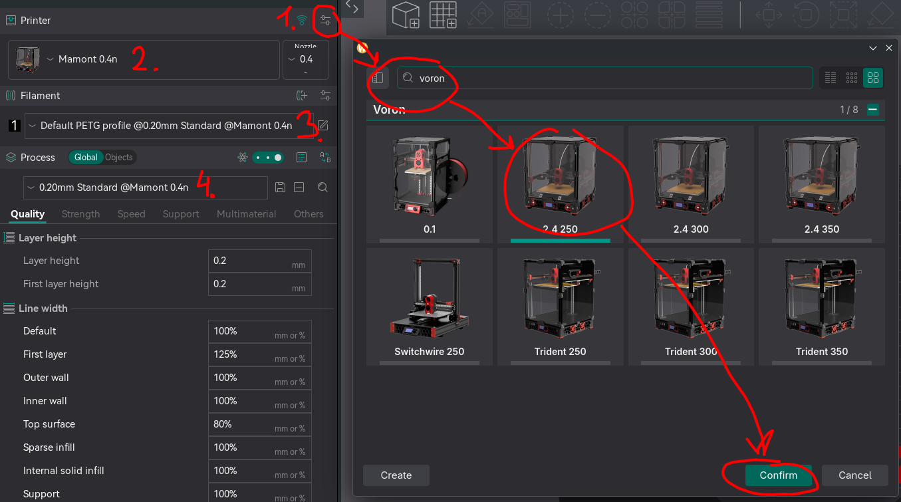

# How to install

1. Go to OrcaSlicer config folder
   - Windows: `%AppData%\OrcaSlicer`
   - Linux: `~/.config/OrcaSlicer` (or on flatpak: `~/.var/app/com.orcaslicer.OrcaSlicer/config/OrcaSlicer`)
   - MacOS: `~/Library/Application Support/OrcaSlicer/`
2. Delete or move old profiles from `user/default`
3. Clone repo or download zip and unpack to `user/default`
4. Your folder structure should be `user/default/{filament,machine,proccess}`
5. Launch OrcaSlicer and click new project
6. Add new printer - **Voron 2.4 250**
7. Set Printer to **Mamont 0.4n**, Filament to **Default PLA profile @0.20mm Standard @Mamont 0.4n**, Process to **0.20mm Standard @Mamont 0.4n**. See screenshot for details

